# ECS Project | Threat Composer Application 
<!-- Project badges -->


## Table of Contents:
- Description
- Repository Structure
- Architecture Diagram
- Reproduction Steps
- Infrastructure (Terraform)
- CI/CD Pipelines

## Project Description: 

Welcome to the Threat Modelling Tool, a containerised web application designed for teams to collaboratively identify and manage security threats. Built for the cloud, this project leverages AWS ECS Fargate for serverless container orchestration, enabling scalable, consistent deployments across all environments.

The application runs inside private subnets, ensuring that core services are isolated from public access. All inbound traffic is routed through an Application Load Balancer (ALB) in a public subnet, enforcing security through obscurity by minimising surface area and exposure. HTTPS is enforced via AWS Certificate Manager (ACM), with Route53 and Cloudflare DNS handling secure and reliable domain resolution.

Infrastructure is fully automated with Terraform and GitHub Actions, enabling repeatable, versioned deployments using Infrastructure as Code (IaC). Docker images are built and pushed to Amazon ECR, then deployed securely through CI/CD pipelines. IAM policies follow least-privilege principles, and the system is modular, scalable, and fault-tolerant by design.


## Repository Structure:

<div align="center">
    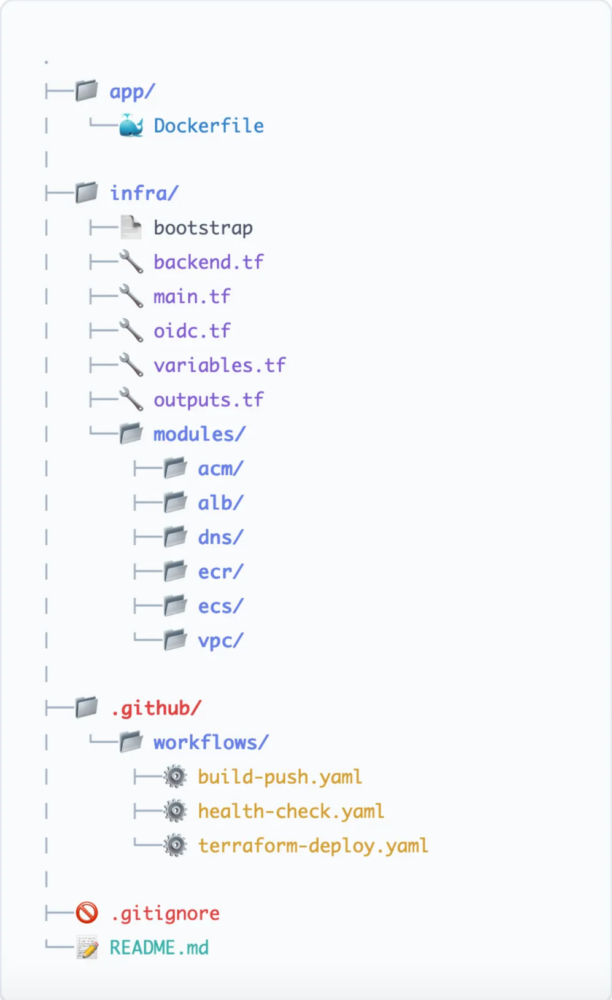
</div>


## Architechture Diagram: 

<div align="center">
    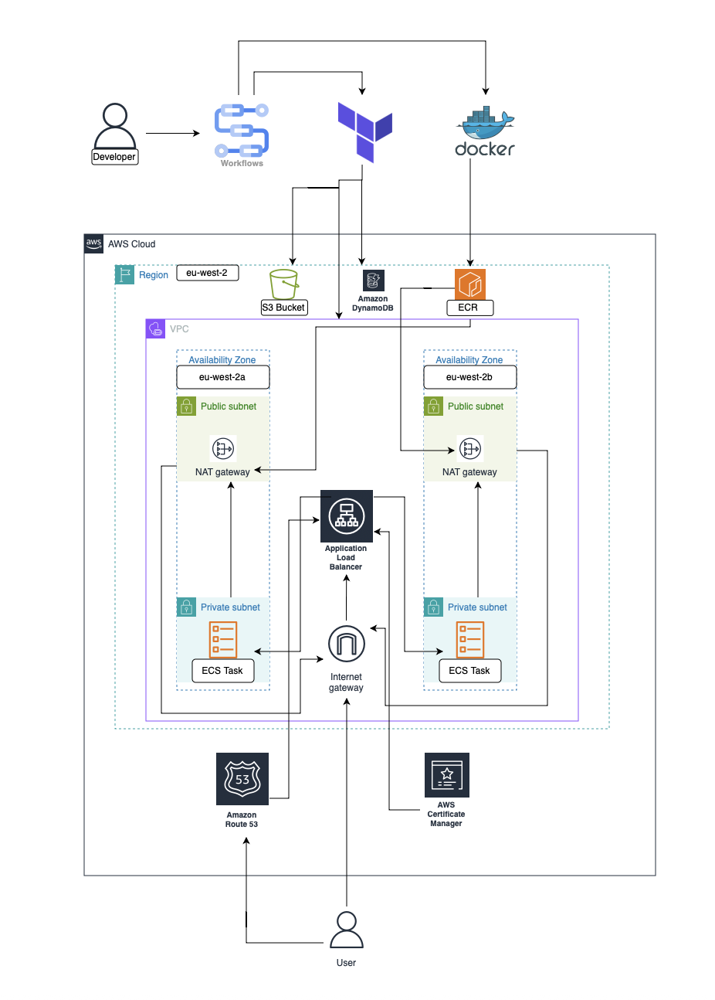
</div>

Key components:
-	VPC with public and private subnets across multiple Availability Zones (AZ)
-	Application Load Balancer (ALB) in public subnets
-	ECS Fargate service running tasks in private subnets
-	NAT Gateway for outbound internet access from private subnets
-	ACM certificate for HTTPS
-	Route 53 + Cloudflare for DNS
-	S3 + DynamoDB remote Terraform state backend
-	GitHub Actions for CI/CD using OIDC

Key Features:
- VPC, subnets, route tables
- Security groups
- Application Load Balancer and listeners
- ECS cluster, task definition and service
- IAM roles and policies
- ECR repository
- ACM certificate

## URL: https://tm.mwaqar.co.uk

<div align="center">
    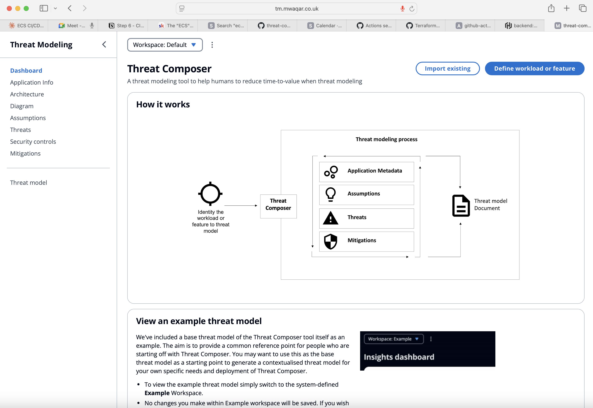
</div>


## Reproduction Steps: 

### Prerequisites

- AWS account
- Terraform
- Docker
- GitHub account and a new repository
- Domain managed via Route 53 and/or Cloudflare


### Step 1: Local Setup:
```bash
yarn install
yarn build
yarn global add serve
serve -s build

#yarn start
http://localhost:3000/workspaces/default/dashboard

## or
yarn global add serve
serve -s build
```
- Exposed a simple route like /health returning {"status": "ok"}

<div align="center">
    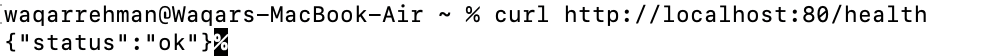
</div>


### Step 2: Containerisation

- Created a Dockerfile for the threat composer app. original image was 2.88GB so used multi-stage to make it smaller. Final image was reduced to 332MB. 

<div align="center">
    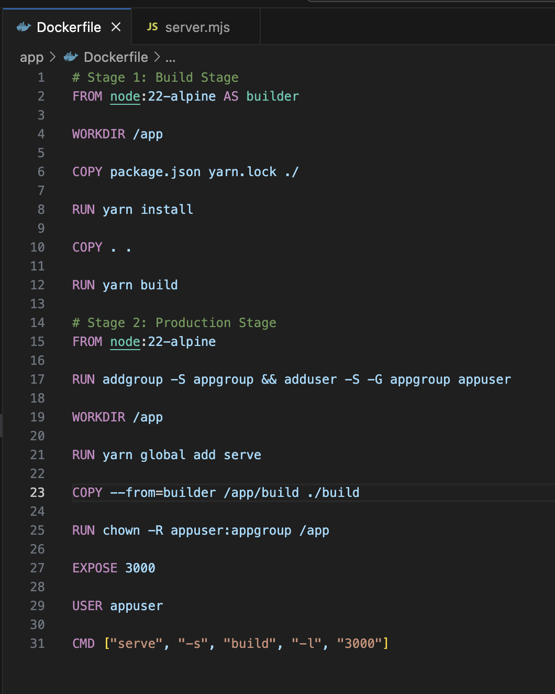
</div>

### Dockerfile Breakdown: 

- Stage 1 - Build Stage
1. **FROM node:22-alpine AS builder** : indicates that it is a node.js and a smaller Alpine image Linux base. 
2. **WORKDIR /app** : everything else happens in /app. 
3. **COPY package.json yarn.lock /** and **RUN yarn install** : install dependencies using just the manifest files. (good for caching).
4. **COPY . .** : put the actual source code into the image
5. **RUN yarn build** : builds the app.

- Stage 2: Prod Stage
1. **RUN addgroup -S appgroup && adduser -S -G appgroup appuser**: Creates a non-root user for security
2. **RUN global add serve**: installs the serve package to serve the static build
3. **COPY - - from =builder /app/build ./build** : copies the build output
4. **RUN chown -R appuser:appgroup /app** : gives permission for non-root user to read files
5. **EXPOSE 3000** : shows that this container listens on port 3000. 
6. **USER appuser** : run global add serve as non-root user 
7. **CMD ["serve", "-s", "build", "-l", "3000"]** : starts the server when the container runs.

- Build the image : “docker build -t threatcomp . “
<div align="center">
    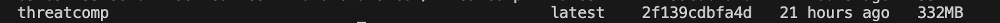
</div>

- Run command: “ docker run -p 3000:3000 threatcomp “

- On web browser open: [http://localhost:](http://localhost:3000)3000 and the app will load up: 

<div align="center">
    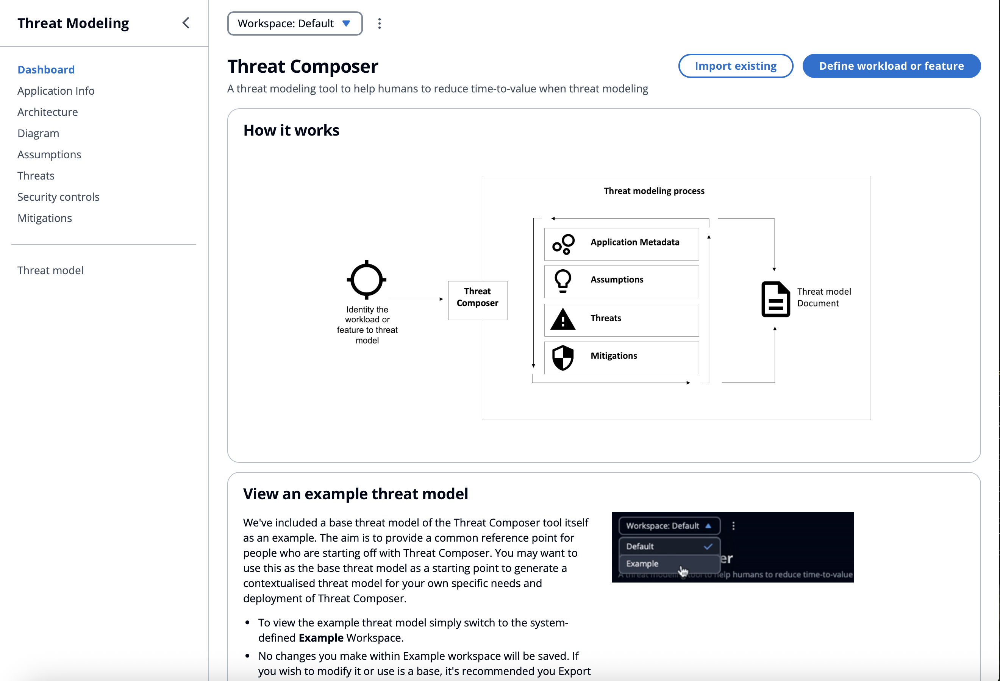
</div>

- Run command “curl [http://localhost](http://localhost):80/health” and it should display this html message on terminal: 

<div align="center">
    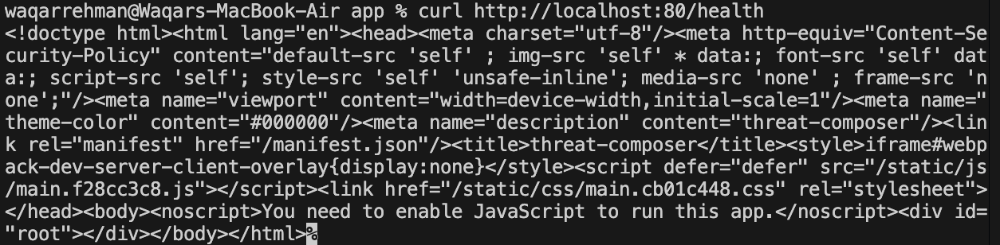
</div>


- Once the link is clicked, it will create a html link in the terminal which redirects the user to the app UI. 


### Step 3: Image Registery (ECR)

Docker image has been pushed to AWS ECR. 

<div align="center">
    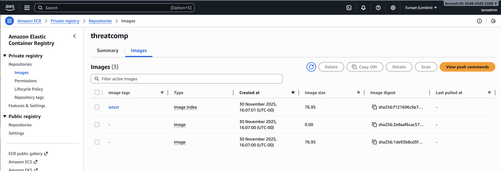
</div>

- The main parts of the infrastructure were first created manually using the AWS console in order to understand how the services fit together.

- Created:
  - ECS Cluster (fargate).
  - Task definitions using the ECR Image.
  - Application Load Balancer.
  - Security Groups.
  - DNS Records.
  - ACM Certificate for HTTPS.

Once the application was reachable via HTTPS, all manual resources were deleted.

### Step 5: IaC (Terraform)

Created the the setup using modular Terraform. The code can be found in the "infra" folder inside this repository. 

- Iniitialised Terraform in the directory:
```bash
terraform init
```

- Iteretively planned and applied infrastructure while building modules:
``` bash
terraform plan
terraform apply
```

- Destroyed infrastructure at the end:
``` bash
terraform destroy
```

### Step 6: CI/CD Automation
Implemented Github Actions for the workflows.

### Build and Push 
<div align="center">
    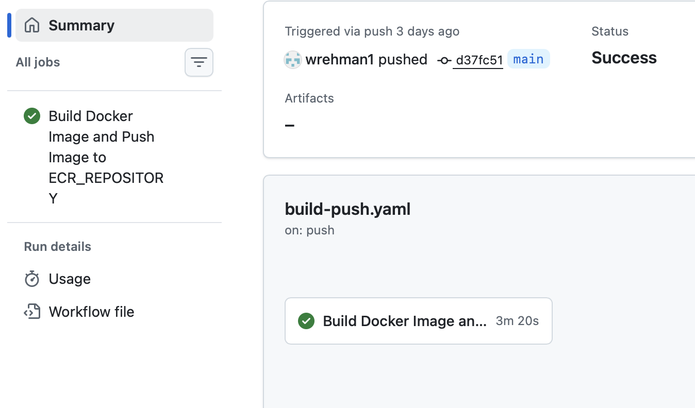
</div>

### Terraform Deploy
<div align="center">
    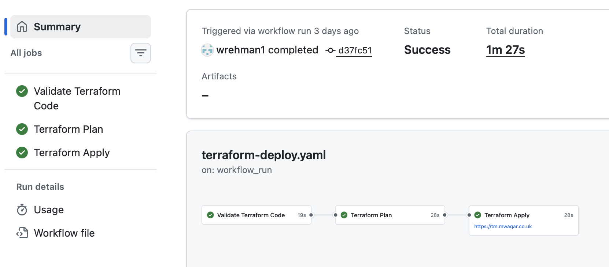
</div>

### Health Check 
<div align="center">
    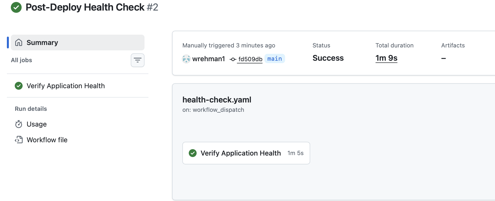
</div>


The end result should be: 

<div align="center">
    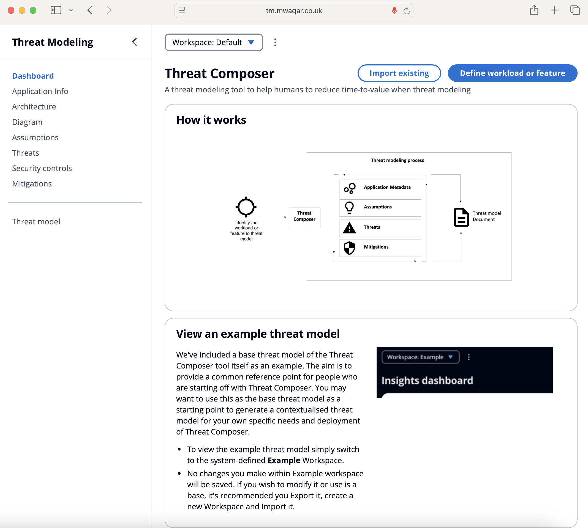
</div>


## Future Improvements:
- Blue/Green deployment
- Auto-scaling policies
- CloudWatch monitoring and alarms
- AWS WAF integration
- Secrets Manager for application secrets
